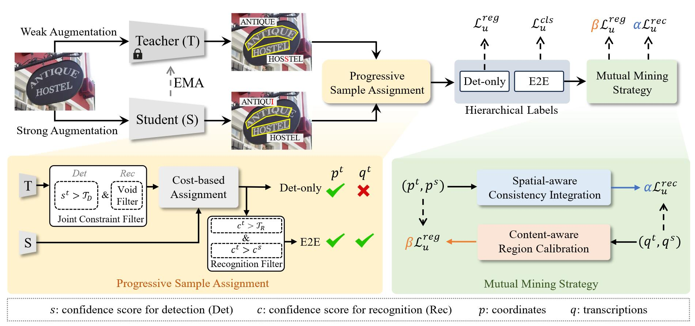

# SemiETS

The official code of 
【CVPR 2025】SemiETS: Integrating Spatial and Content Consistencies for Semi-Supervised End-to-end Text Spotting

<div align="center">
  
</div>

## 🚀 TODO List

- [ ] Release Code (on going)
- [x] Release Data Splits
- [ ] Establish User Document (on going)

## Usage

### Installation

Python 3.8 + Pytorch 1.9.0 + CUDA 11.1 + Detectron2 (v0.6) + ctcdecode


### Preparation

</details>
<summary>Datasets</summary>

Download datasets from [here](https://github.com/ViTAE-Transformer/DeepSolo/blob/main/DeepSolo/README.md#preparation)

*Some image files need to be renamed.* Organize them as follows (lexicon files are not listed here):

```
|- ./datasets
   |- syntext1
   |  |- train_images
   |  └  annotations
   |       |- train_37voc.json
   |       └  train_96voc.json   
   |- syntext2
   |  |- train_images
   |  └  annotations
   |       |- train_37voc.json
   |       └  train_96voc.json
   |- totaltext
   |  |- train_images
   |  |- test_images
   |  |- train_37voc.json
   |  |- train_96voc.json
   |  |- train_37voc_0.5_labeled.json
   |  |- train_37voc_0.5_unlabeled.json
   |  |- train_37voc_1_labeled.json
   |  |- train_37voc_1_unlabeled.json
   |  |- train_37voc_2_labeled.json
   |  |- train_37voc_2_unlabeled.json
   |  |- train_37voc_5_labeled.json
   |  |- train_37voc_5_unlabeled.json
   |  |- train_37voc_10_labeled.json
   |  |- train_37voc_10_unlabeled.json  
   |  └  test.json
   |- ic15
   |  |- train_images
   |  |- test_images
   |  |- train_37voc.json
   |  |- train_96voc.json
   |  |- train_37voc_0.5_labeled.json
   |  |- train_37voc_0.5_unlabeled.json
   |  |- train_37voc_1_labeled.json
   |  |- train_37voc_1_unlabeled.json
   |  |- train_37voc_2_labeled.json
   |  |- train_37voc_2_unlabeled.json
   |  |- train_37voc_5_labeled.json
   |  |- train_37voc_5_unlabeled.json
   |  |- train_37voc_10_labeled.json
   |  |- train_37voc_10_unlabeled.json  
   |  └  test.json
   |- ctw1500
   |  |- train_images
   |  |- test_images
   |  |- train_96voc.json
   |  |- train_96voc_0.5_labeled.json
   |  |- train_96voc_0.5_unlabeled.json
   |  |- train_96voc_1_labeled.json
   |  |- train_96voc_1_unlabeled.json
   |  |- train_96voc_2_labeled.json
   |  |- train_96voc_2_unlabeled.json
   |  |- train_96voc_5_labeled.json
   |  |- train_96voc_5_unlabeled.json
   |  |- train_96voc_10_labeled.json
   |  |- train_96voc_10_unlabeled.json  
   |  └  test.json
   |- evaluation
   |  |- gt_*.zip
```
</details>

## Citation
If you find [SemiETS](https://arxiv.org/abs/2504.09966) useful for your research and applications, please cite using this BibTeX:

```
@article{luo2025semiets,
  title={SemiETS: Integrating Spatial and Content Consistencies for Semi-Supervised End-to-end Text Spotting},
  author={Luo, Dongliang and Zhu, Hanshen and Zhang, Ziyang and Liang, Dingkang and Xie, Xudong and Liu, Yuliang and Bai, Xiang},
  journal={CVPR},
  year={2025}
}
```

## Acknowledgement
This project is based on [DeepSolo](https://github.com/ViTAE-Transformer/DeepSolo) and [Adelaidet](https://github.com/aim-uofa/AdelaiDet). We appreciate their wonderful codebase. For academic use, this project is licensed under the 2-clause BSD License.

